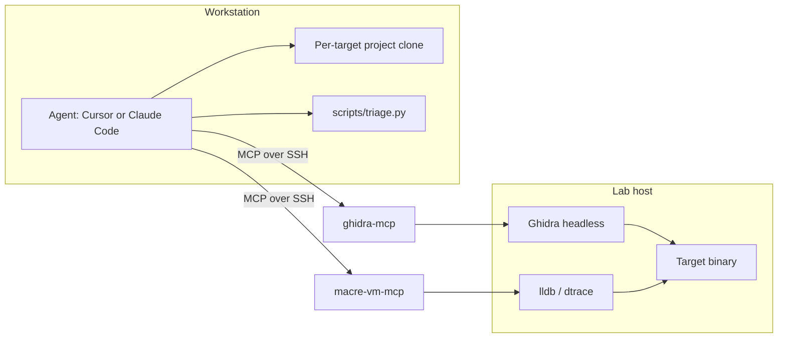
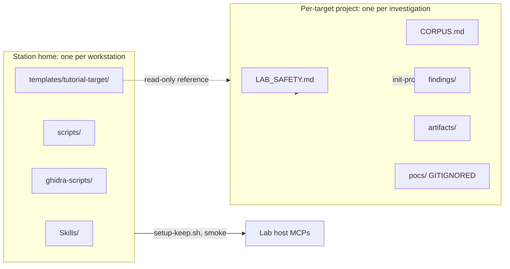
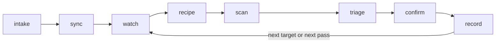
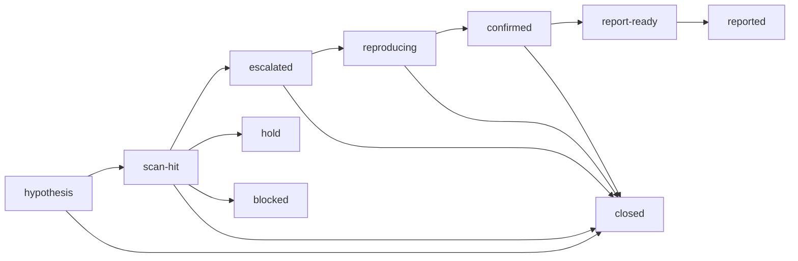

# AI-assisted reversing — diagrams and whiteboard prompts

**Preview in VS Code / Cursor:** blocks below are **Mermaid** (the opening fence must be tagged `mermaid`). VS Code's stock preview does **not** render Mermaid; install **Markdown Preview Mermaid Support** (`bierner.markdown-mermaid`) from this repo's recommended extensions, then run **Markdown: Open Preview** again. GitHub renders the same syntax on the web. If the preview shows **No diagram type detected matching given configuration for text:**, another Mermaid-related extension is usually fighting the preview — keep **`bierner.markdown-mermaid` enabled**, **disable or uninstall** extensions such as **Mermaid Chart** (`MermaidChart.vscode-mermaid-chart`) or **Mermaid Preview** (`vstirbu.vscode-mermaid-preview`), then **Developer: Reload Window** and open the preview again.

## 0. Elevator: the station in one breath

The **Reversing Station** is a **two-machine** rig where an LLM agent on your **workstation** drives **Ghidra** and **lldb** on a separate **lab host** over SSH, via two MCP servers. Every pass produces hash-pinned evidence in a project ledger; the deliverable is a **defensible closure rationale**, not an exploit.

---

## 1. Two-machine topology

Use when explaining Session 0 / Session A.



**Whiteboard:** "Workstation thinks. Lab host executes. Two MCPs over SSH."

## 2. Two clones, two homes

Use when students confuse "the station" with "their target's project."



**Teaching point:** The **station home** is shared infra — never put per-target findings there. The **project clone** is your investigation — never put station infra there. `pocs/` is gitignored by template; PoC code stays in the project, not the station.

## 3. The pass loop

Use when explaining Session B.



**Whiteboard one-liner:** "Each step writes a file. Closure rationale is the deliverable."

## 4. Three-tier evidence model

Use when explaining the scan output (Session D).

| Tier | Source | Use |
|------|--------|-----|
| **A** | Decompiler-recovered callsite **with a literal argument** | Ready for an lldb breakpoint without further analysis. **Triage these first.** |
| **B** | Mach-O / ObjC metadata only | Inventory: "what *might* be reachable." Sometimes wrong about reachability. |
| **C** | String / grep heuristic | High false-positive rate. Only triage if A and B miss the bug. |

**Teaching point:** False-positive density goes **up** as evidence quality goes **down**. On a real Electron app: tier A produced 14 anchors (2 real bugs, 12 closed-with-rationale); tier C produced 240 hits at 100% noise.

## 5. Triage state machine

Use when explaining Session E.



**Whiteboard one-liner:** "There is no `interesting` state. You either promote or close with rationale."

**Teaching point:** `closed` requires `--reason`. A closure without rationale is rejected by `triage.py`. Closures count toward `METRICS.md` — a closed candidate is research output, not a failure.

## 6. The wrong-door bug class

Use when explaining the planted daemon's primary bug.

```mermaid
sequenceDiagram
  participant Cpriv as Client (connects to .privileged)
  participant Cint as Client (connects to .internal)
  participant L as Listener
  participant D as DaemonDelegate
  Cpriv->>L: connect to com.tutorial.daemon.privileged
  Cint->>L: connect to com.tutorial.daemon.internal
  L->>D: listener:shouldAcceptNewConnection: (no branching)
  D-->>L: YES; exportedInterface = InternalOps
  Note over D: Same interface for both ports.<br/>Service-name split is cosmetic.
  L-->>Cpriv: channel open as InternalOps
  L-->>Cint: channel open as InternalOps
```

**Whiteboard one-liner:** "Two listeners, one delegate, no branch on listener identity = wrong door."

## 7. Static vs dynamic — what each adds

| Phase | Strength | Limit |
|-------|----------|-------|
| **Static** (Ghidra) | Surfaces every callsite; cheap to rerun | Wrong about **reachability** when there are runtime branches, feature flags, environment gates |
| **Dynamic** (lldb attach) | Confirms reach against a running daemon; catches the post-check re-derivation pattern | Per-OS, per-build; modifies process state if you let it |

**No implementation here** — link forward to `lldb_run_anchors` and the `gatehouse-ghidra-lldb` skill in [`STUDENT_GUIDE.md`](STUDENT_GUIDE.md), and to Apple's Security framework docs for `SecCodeCheckValidityWithErrors`.
