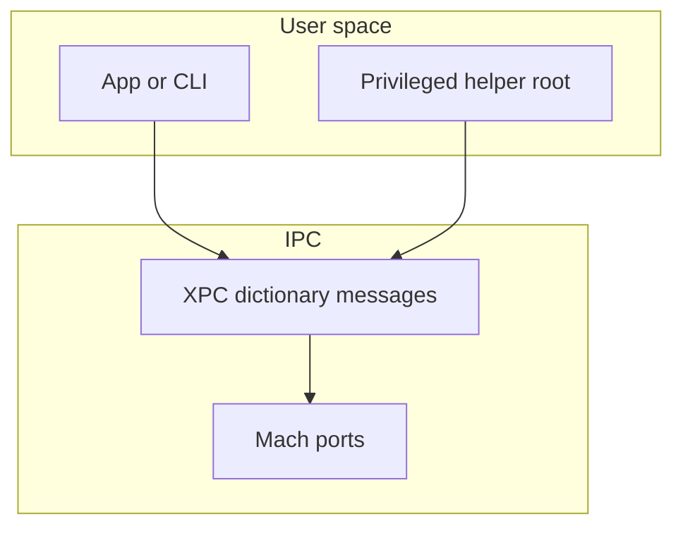
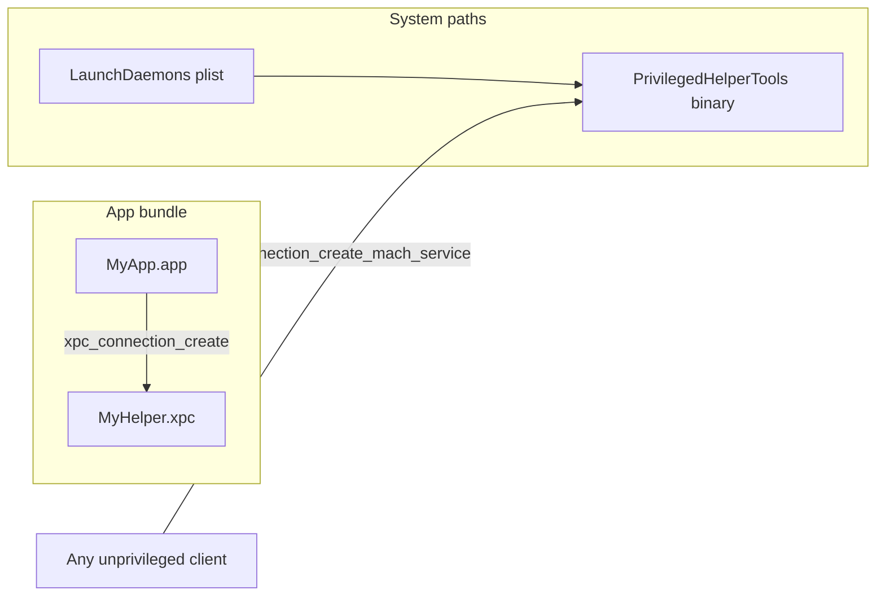
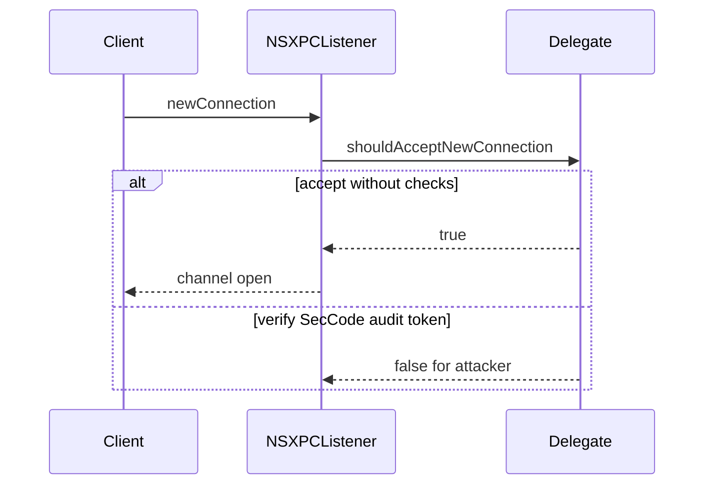

# Chapter 8 — diagrams and whiteboard prompts

## 0. Elevator: XPC in one breath

**XPC** = typed **dictionary** messages between processes, on top of **Mach** ports. **NSXPC** = Cocoa protocols and proxies over the same idea. **Privileged helpers** = small root daemons reached by name — if trust checks are wrong, IPC becomes **remote root**.

---

## 1. Where XPC sits

Use when explaining §8.1 (IPC stack).

**Whiteboard:** “XPC = typed dictionaries + connections; underneath = Mach.”

## 2. App-embedded vs global Mach service

**Teaching point:** Embedded helpers are **scoped** to the app; **LaunchDaemon** + `MachServices` can expose a name **globally** — the helper **must** authenticate callers.

## 3. NSXPC trust gate

**Whiteboard one-liner:** “If `shouldAcceptNewConnection:` returns `YES` for everyone, your root helper is a public API.”

## 4. PID vs audit token (conceptual)

| Signal      | Pros                               | Cons                                                |
| ----------- | ---------------------------------- | --------------------------------------------------- |
| PID         | Easy (`processIdentifier`)         | **PID reuse** races                                 |
| Audit token | Binds check to **this** connection | Historically awkward in App Store / pure Swift APIs |

**No implementation here** — link forward to verification APIs in `STUDENT_GUIDE.md` and Apple / Security framework docs.